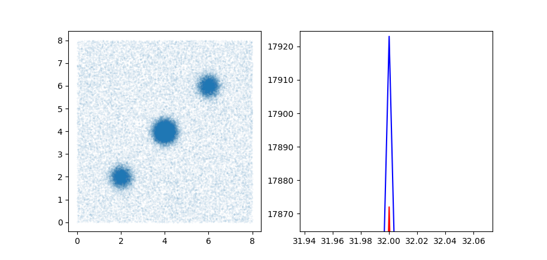

# DifferentialPrivacy 仿真实验

## 1 程序结构

```plain
.
├── hilbertcurve
│   └── hilbertcurve.py
├── rappor
│   ├── rappor.py
│   └── stat.py
├── README.md
└── test
    ├── hilbertcurve_test.py
    ├── rappor_stat_test.py
    └── rappor_test.py
```

- ./hilbertcurve/为Hilbert曲线的实现。
- ./rappor/为RAPPOR的实现。
- ./test/为测试文件。在test文件夹中，rappor_test测试rappor模块，hilbertcurve_test测试hilbertcurve模块，rapport_stat_test测试rappor模块的stat。

## 2 参考链接

RAPPOR的随机响应部分参照[RAPPOR: Randomized Aggregatable Privacy-Preserving Ordinal Response](https://www.oalib.com/paper/4065462#.YGgArXVfjgk)；统计方法以[满足本地差分隐私的位置数据采集方案](http://jst.tsinghuajournals.com/CN/10.16511/j.cnki.qhdxxb.2018.22.058)提出的直接统计法为基础；Hilbert曲线的实现参照[Damn Cool Algorithms: Spatial indexing with Quadtrees and Hilbert Curves](http://blog.notdot.net/2009/11/Damn-Cool-Algorithms-Spatial-indexing-with-Quadtrees-and-Hilbert-Curves)。

## 3 仿真内容

实验的主要参数为：区域内Hilbert曲线的迭代次数order，RAPPOR的差分隐私参数f、p、q。实验选取的参数为order=3、f=0、p=0.5、q=0.75（f、p、q为论文中讨论正态分布时给出的参数）。  

首先在区域内生成随机点。现实情况下，人群往往在一些旅游区、商业区聚集，从而形成较高的人流密度。在仿真实验中，我们设置了三个聚集区，每个聚集区中的数据点服从正态分布；在聚集区外，数据点随机分布。在区域内生成随机点后，使用Hilbert曲线填充区域，将距离数据点最近的值作为该数据点的索引。假设Hilbert曲线的长度为n，数据点的索引为i。对数据点进行位置编码：初始化一个长度为n的全0数组K，并将第i位置1。将该数组经过RAPPOR的两次随机响应处理，得到扰动后的数组K'。以上是模拟客户端上传扰动数据的过程。  

对于服务器，在接受到大量用户的扰动数据后，进行统计处理分析。统计方法采用直接统计法，最后得到分析结果。

## 4 仿真结果

下图为Hilbert曲线迭代3次、随机点数量为6400的实验结果。左侧为生成的随机点，可见存在三个聚集区，其余区域的数据点随机分布。右侧蓝色折线为实际点位的密度分布，红色折线为统计分析结果得出的数据点密度分布。由右图可见，聚集区的统计分析结果与实际点位密度分布的误差较小，而非聚集区的误差较大。
  

下图的右图展示了聚集区统计分析结果的误差。此次实验中聚集点的估计值误差不超过10%，在可接受的范围内。（实验存在随机性，因此误差可能存在浮动）


数据点数量越大，误差越小。下图为Hilbert曲线迭代3次、随机点数量位64000的实验结果。


